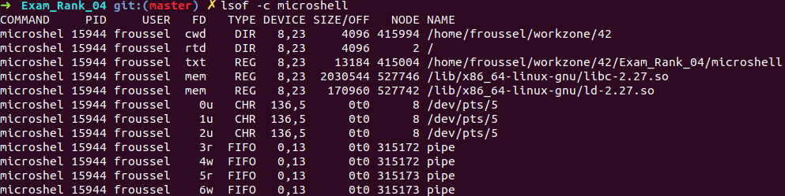

# Exam_Rank_04

https://www.thegeekstuff.com/2012/08/lsof-command-examples/ 

<strong>List opened files based on process names starting with</strong> 
You can list the files opened by process names starting with a string, using ‘-c’ option. 
-c followed by the process name will list the files opened by the process starting with 
that processes name. You can give multiple -c switch on a single command line. 

Put your program in an infinite loop

